# Architectural Diagrams — Internal Work Management Platform

## 1. Architecture Overview

The system is a private, multi-workspace web application supporting either:

- One Solo Freelancer workspace with one owner
- One Team workspace with 2–5 people, including one Team Head

Clients are not users and have no access.

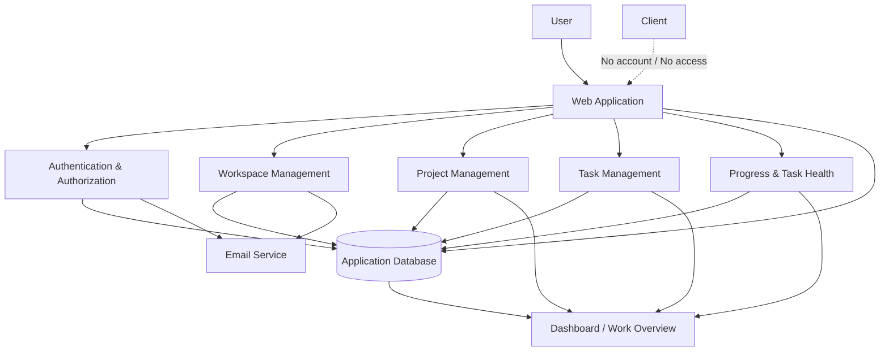

---

## 2. High-Level System Architecture

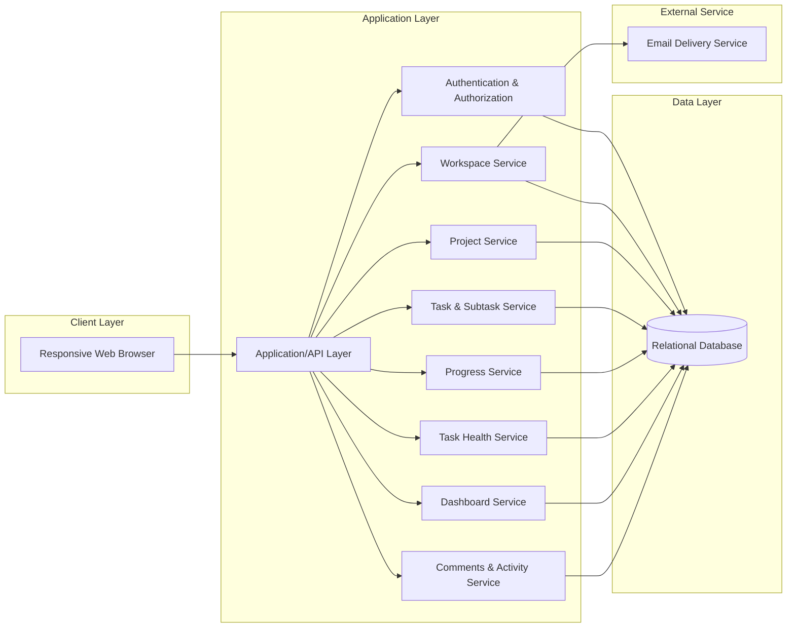

### Architectural principle

Keep the architecture modular but lightweight. The system should not be over-engineered for the initial 1–5-person workspace model.

---

## 3. User and Workspace Architecture

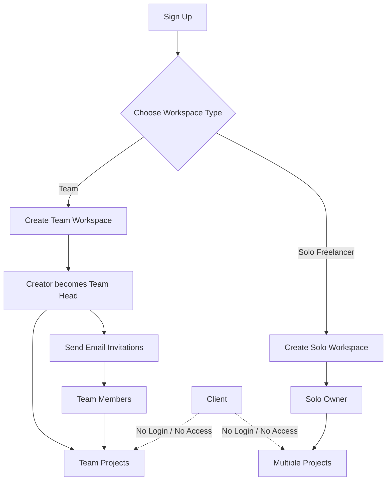

---

## 4. Workspace Relationship Model

### Solo

```text
User
└── Solo Workspace
    ├── Project
    │   ├── Task
    │   └── Task
    ├── Project
    └── Project
```

### Team

```text
User
└── Team Workspace
    ├── Team Head
    ├── Team Member
    ├── Team Member
    ├── Team Member
    ├── Team Member
    │
    ├── Project
    │   ├── Task → Member
    │   ├── Task → Member
    │   └── Task
    │
    └── Project
```

A Team workspace must contain exactly one Team Head and between 1 and 4 additional members.

---

## 5. Entity Relationship Diagram

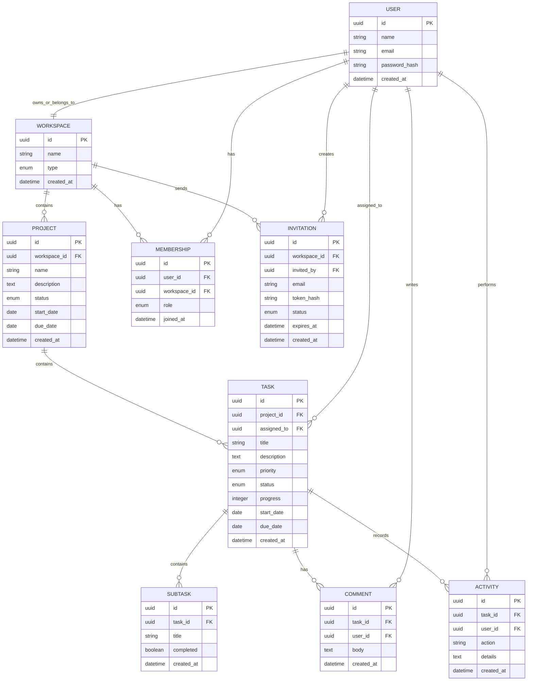

### Important data rules

1. One account maps to exactly one workspace in the MVP.
2. A user cannot belong to multiple Team workspaces.
3. A Team workspace has one Team Head.
4. Team membership is limited to 2–5 total people.
5. Subtasks have one level only; subtasks cannot contain subtasks.
6. Completed task history retains the historical assignee.
7. Open tasks of a removed member must be reassigned or explicitly left unassigned.
8. Clients have no user records or workspace membership.

---

## 6. Task Lifecycle

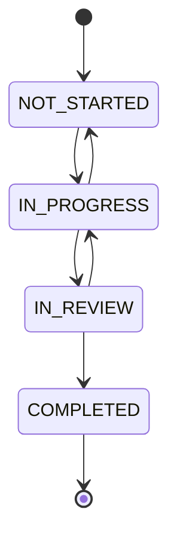

Task health is separate from task status.

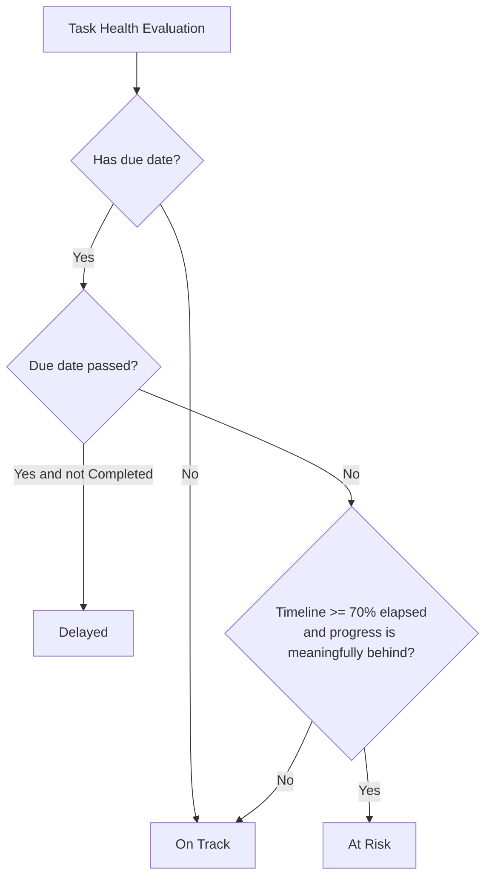

### MVP health rules

- Due date passed and status is not Completed → **Delayed**
- No due date → **On Track**
- No start date → use task creation date as fallback
- 70% or more of the timeline elapsed and progress is more than 20 percentage points behind elapsed time → **At Risk**
- Otherwise → **On Track**

---

## 7. Progress Architecture

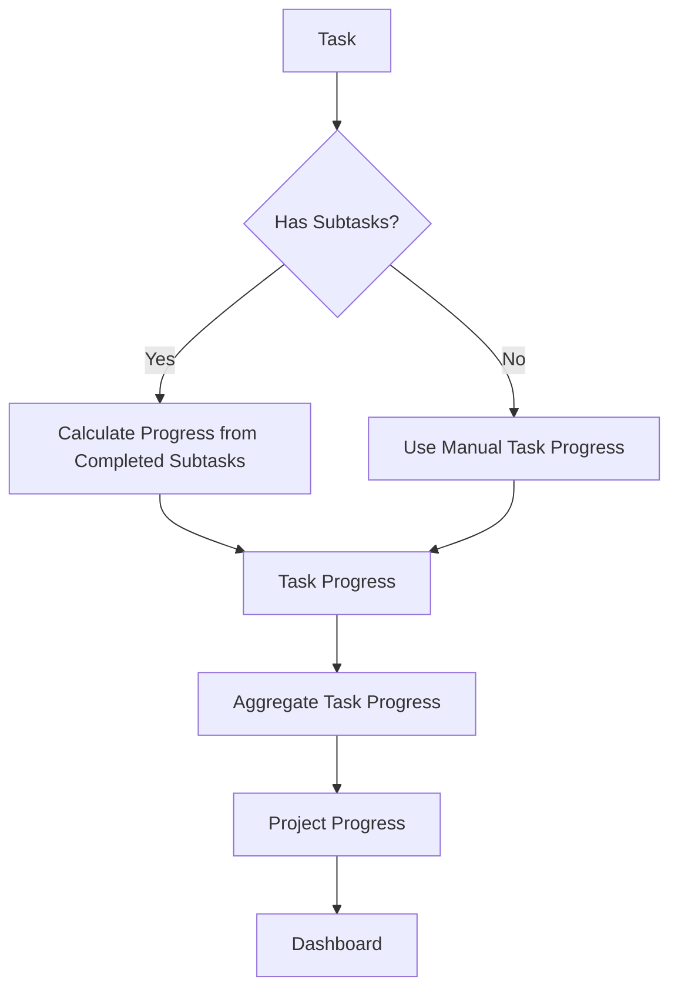

### Progress precedence

- A task with subtasks uses automatically calculated progress.
- A task without subtasks uses manually entered progress.
- Project progress is an aggregate of task progress.
- Manual project-level override is not supported in the MVP.

---

## 8. Team Invitation Architecture

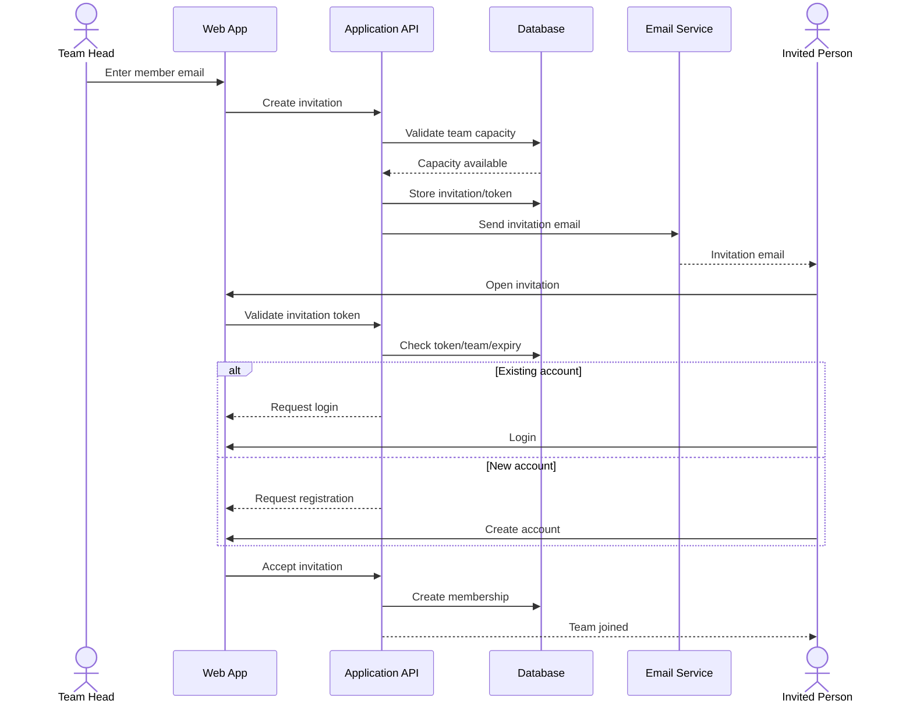

---

## 9. Member Removal and Task Reassignment

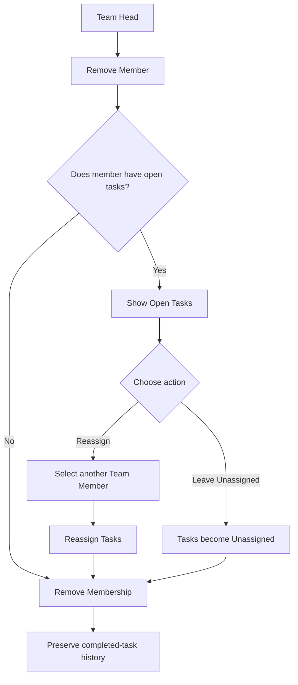

---

## 10. Team Head Continuity

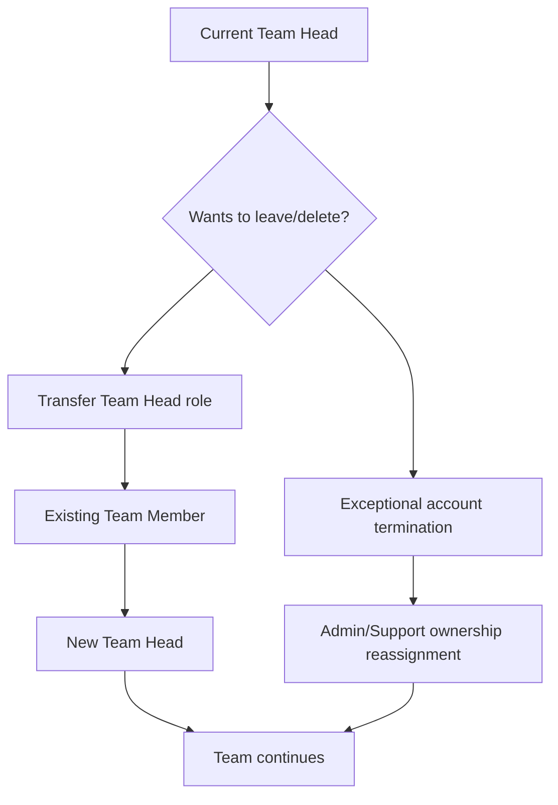

The system must never intentionally leave a Team workspace without a Team Head.

---

## 11. Dashboard Data Flow

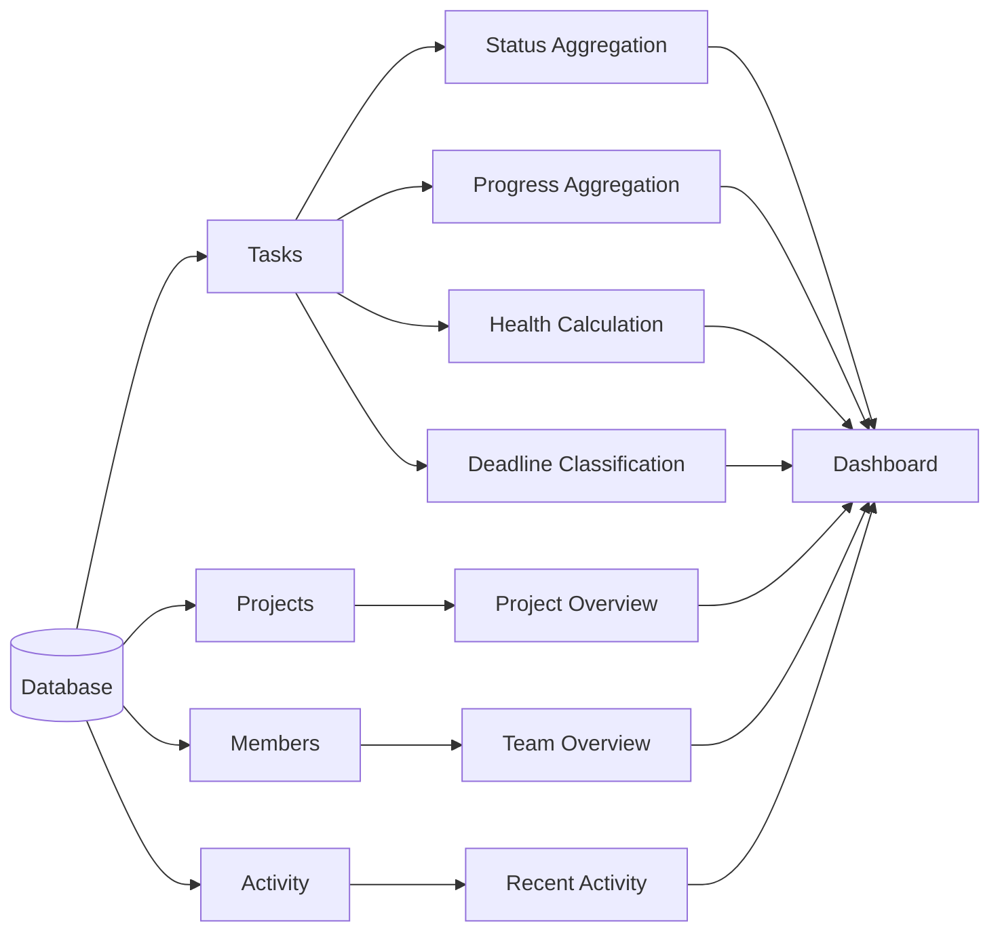

---

## 12. Authorization Model

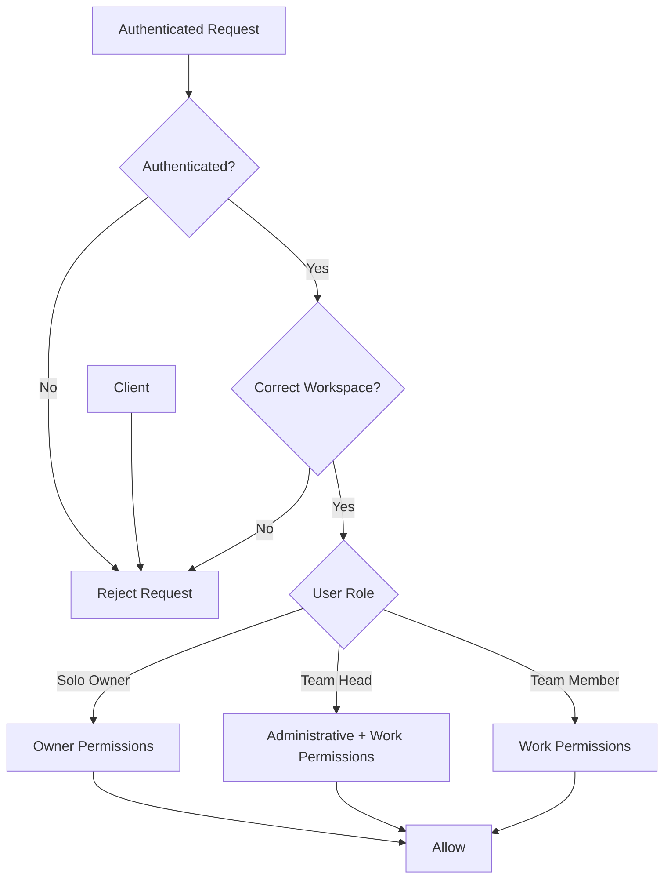

Authorization must be enforced on the server/API layer, not only through UI visibility.

---

## 13. Suggested Frontend Structure

```text
src/
├── auth/
│   ├── signup
│   ├── login
│   └── invitation
│
├── workspace/
│   ├── workspace-selection
│   ├── solo
│   └── team
│
├── dashboard/
│
├── projects/
│   ├── project-list
│   ├── project-detail
│   └── project-form
│
├── tasks/
│   ├── task-list
│   ├── task-detail
│   ├── task-form
│   └── subtasks
│
├── team/
│   ├── members
│   ├── invitations
│   └── settings
│
└── shared/
    ├── components
    ├── layouts
    └── utilities
```

This is a conceptual structure; the eventual framework may change it.

---

## 14. Suggested Backend Modules

```text
backend/
├── auth
├── users
├── workspaces
├── memberships
├── invitations
├── projects
├── tasks
├── subtasks
├── comments
├── activities
├── progress
├── task-health
└── dashboard
```

Each module should enforce workspace boundaries and role permissions.

---

## 15. Phase-to-Architecture Mapping

| Phase | Main Architectural Components |
|---|---|
| Phase 1 | Authentication, Users, Database foundation |
| Phase 2 | Workspaces, Memberships, Roles, Invitations |
| Phase 3 | Projects |
| Phase 4 | Tasks, Subtasks, Comments, Activities |
| Phase 5 | Progress, Deadline Classification, Task Health |
| Phase 6 | Dashboard, Collaboration, Responsive UI |
| Phase 7 | Testing, Security, Performance, Deployment |

---

## 16. Architecture Scope Boundaries

The architecture must preserve these constraints:

- No client authentication
- No client authorization
- No client dashboard
- No client workspace membership
- Solo or Team workspace selection at signup
- One workspace per account in MVP
- Team Head automatically assigned
- 2–5 total team members
- Email-only invitations in MVP
- Single-level subtasks
- Explicit task reassignment when members are removed
- Team Head continuity
- Separate task status and task health
- Explicit progress precedence rules
- Lightweight architecture suitable for small teams
